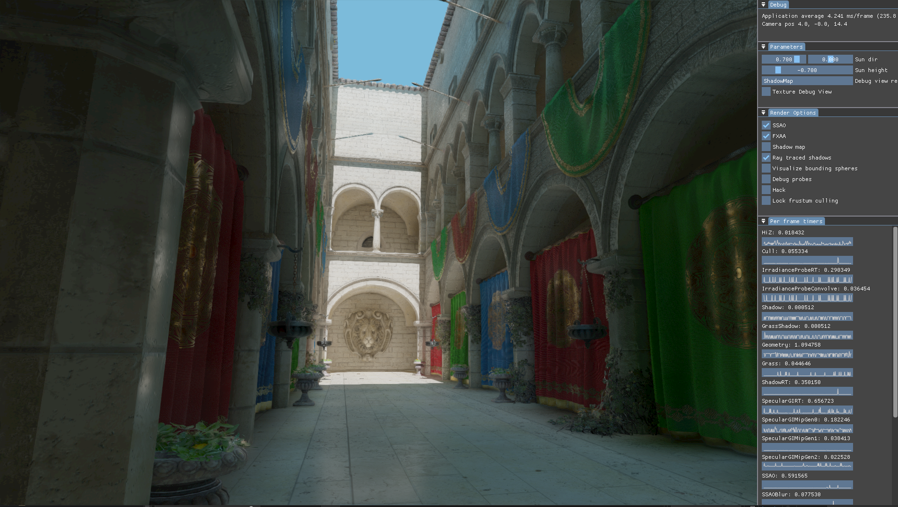
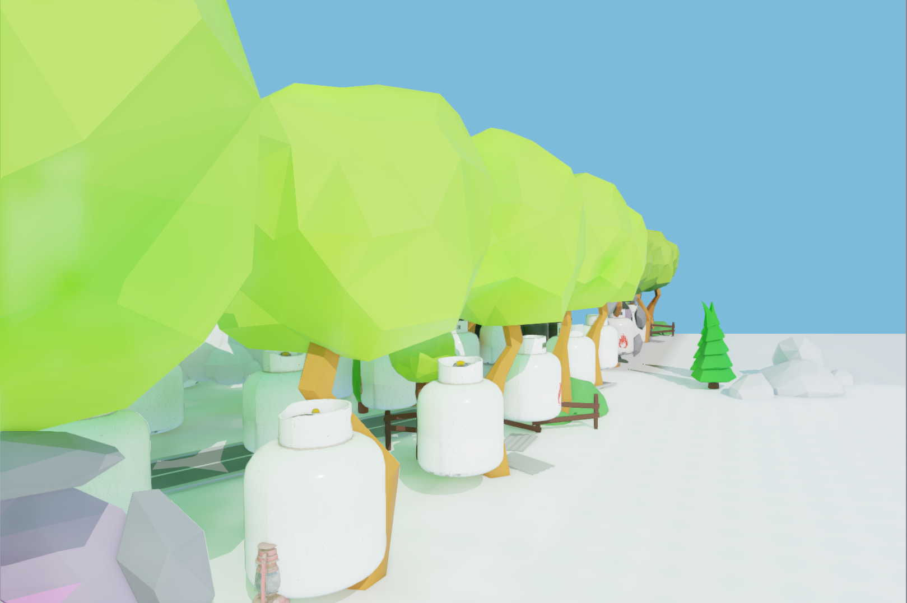
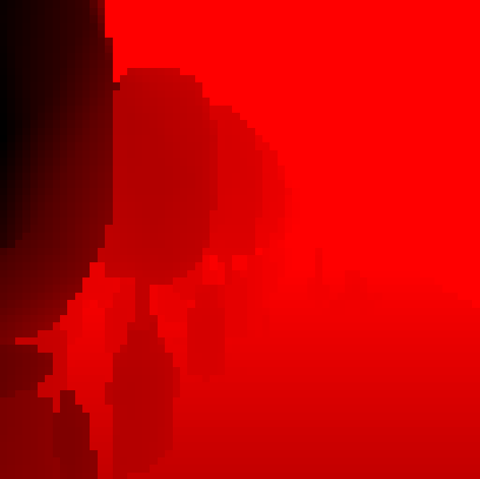
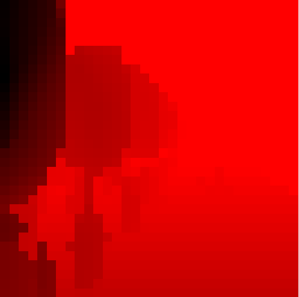
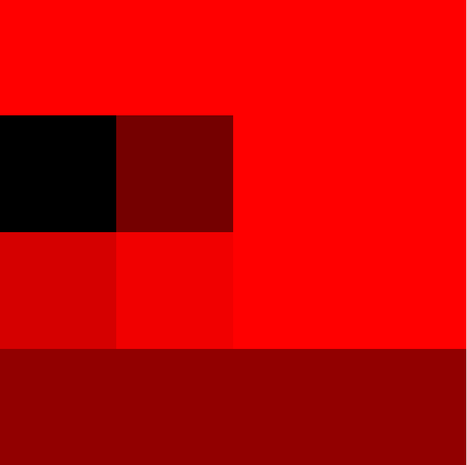

# AneRend


_PBR Sponza example scene with global illumination (DDGI) and ray traced hard shadows turned on_

AneRend is a Vulkan renderer where I prototype state-of-the-art rendering techniques. Among those currently implemented in some form are:
+ Diffuse Dynamic Global Illumination (DDGI)
+ Ray-traced specular Global Illumination
+ Ray-traced hard shadows
+ Hierarchical Z occlussion culling (HiZ)
+ Bindless GPU-driven rendering 
+ Cook-Torrance BRDF PBR lighting
+ Deferred tiled rendering for many lights
+ Ghost of Tsushima-inspired procedural grass
+ Frame graph

## Frame graph
The frame graph representation allows quicker development on the CPU-side. It also helps with a general overview of how a frame is constructed
as well as provides an abstraction layer where the engine can generalise details which would otherwise have to be manually handled, such as 
memory barriers between resource access. The implementation is based on [this talk by Yuriy O'Donnell](https://www.gdcvault.com/play/1024612/FrameGraph-Extensible-Rendering-Architecture-in)
from Frostbite EA.

Generally a render pass will look like this on the CPU-side:
```
  RenderPassRegisterInfo info{};
  info._name = "A render pass";

  {
    ResourceUsage usage{};
    usage._resourceName = "SomeTexture";
    usage._access.set((std::size_t)Access::Read);
    usage._stage.set((std::size_t)Stage::Compute);
    usage._type = Type::ImageStorage;
    info._resourceUsages.emplace_back(std::move(usage));
  }
  {
    ResourceUsage usage{};
    usage._resourceName = "SomeOtherTexture";
    usage._access.set((std::size_t)Access::Write);
    usage._stage.set((std::size_t)Stage::Compute);
    usage._type = Type::ImageStorage;
    info._resourceUsages.emplace_back(std::move(usage));
  }

  ComputePipelineCreateParams pipeParam{};
  pipeParam.device = rc->device();
  pipeParam.shader = "shader.spv";

  info._computeParams = pipeParam;

  fgb.registerRenderPass(std::move(info));

  fgb.registerRenderPassExe("A render pass",
  [this](RenderExeParams exeParams) {

    // Bind pipeline
    vkCmdBindPipeline(*exeParams.cmdBuffer, VK_PIPELINE_BIND_POINT_COMPUTE, *exeParams.pipeline);

    vkCmdBindDescriptorSets(
      *exeParams.cmdBuffer,
      VK_PIPELINE_BIND_POINT_COMPUTE,
      *exeParams.pipelineLayout,
      1, 1, &(*exeParams.descriptorSets)[0],
      0, nullptr);

    vkCmdDispatch(*exeParams.cmdBuffer, numX, numY, 1);
  });

```

The engine will automatically add appropriate resource barriers as well as things like debug timers for each registered render pass. 
When the execution of the pass begins, all relevant resources are accessible via the exeParams, e.g. the descriptor sets. Since
the engine uses a "bindless" approach, a single buffer for geometry vertices and indices is used and bound by the engine before all the
render passes execute. Additional bindless descriptors include a material buffer, a scene UBO, a mesh buffer amongst others. This way
only the specific descriptors (and the pipeline) used by the render pass are bound, reducing overhead.

Below is a list of the (current) render passes and some discussions on key parts.

## HiZ
Since the engine utilises a completely GPU-driven draw call generation, some form of culling of renderables is required. This pass generates
the hierarchical depth mips used for occlusion culling.

The idea is to use the previous frame's depth buffer and generate a mip chain from it. When culling each renderable, the culling shader
looks up a level where each pixel roughly corresponds to the current renderables bounding volume's size. 

The trick is to use a special sampler for sampling the depth buffer when generating the mips, that always chooses the maximum value of
the region it is sampling from. This way a conservative depth mip is achieved.

Here is an example of how this mip may look like (rendered scene, 64x64, 32x32 and 4x4 mips shown):

|  |
|:--:|
| _Source for the hiz mips_ |

|  |
|:--:|
| _64x64 'max-sampled' mip_ |

||
|:--:|
|_32x32 'max-sampled' mip_|

||
|:--:|
|_4x4 'max-sampled' mip_|

References: https://interplayoflight.wordpress.com/2017/11/15/experiments-in-gpu-based-occlusion-culling/

## Cull

## IrradianceProbeTrans

## IrradianceProbeRT

## IrradianceProbeConvolve

## Geometry

## Grass

## ShadowRT

## SpecularGIRT

## SpecularGIMipGen

## SSAO and SSAOBlur

## FXAA

## DebugBoundingSpheres and DebugView

## UI

## Present
