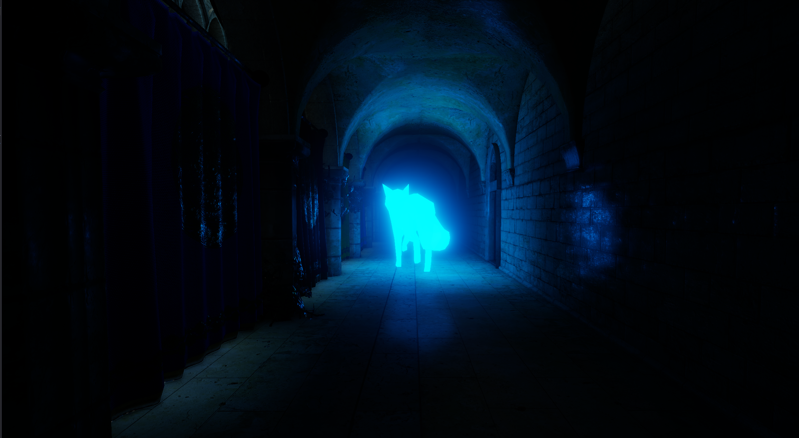
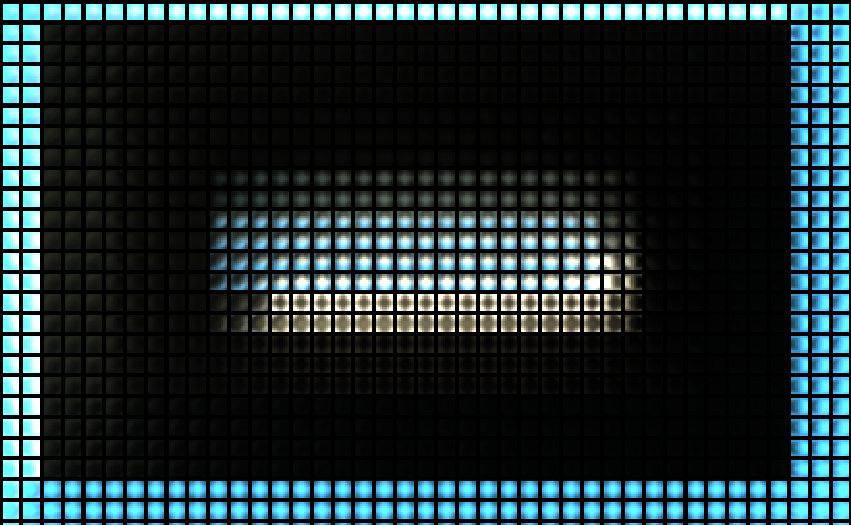

# Anerend


_Global illumination showcase: Fox with emissive material, rendered in a dark corridor of the Sponza scene_


_PBR Sponza example scene with global illumination (DDGI) and ray traced hard shadows turned on_

Anerend is a Vulkan renderer where I prototype state-of-the-art rendering techniques. Among those currently implemented in some form are:
+ Diffuse Dynamic Global Illumination (DDGI)
+ Ray-traced specular Global Illumination
+ Ray-traced hard shadows
+ Hierarchical Z occlussion culling (HiZ)
+ Call of Duty-style temporally stable Bloom
+ Bindless GPU-driven rendering 
+ Cook-Torrance BRDF PBR lighting
+ Deferred tiled rendering for many lights
+ Ghost of Tsushima-inspired procedural grass
+ Auto-exposure
+ Frame graph
+ Component based design using EnTT
+ Physics simulation using Jolt (WIP)
+ Simple terrain support, including material painting

The repo also contains (currently unused) stubs of surfel-based global illumination techniques.

## Global illumination based on irradiance field probes
The engine uses a realtime ray-traced irradiance probe approach for the diffuse global illumination. It is heavily inspired
by [Dynamic Diffuse Global Illumination](https://www.jcgt.org/published/0008/02/01/paper-lowres.pdf), but currently lacks the
statistical depth recording.

The camera is surrounded by a grid of irradiance probes. On a fixed time basis, defaulted at 30Hz, each probe samples the incoming
light by sending out a configurable amount of rays in a uniform spherical pattern. The pattern is a [fibonacci lattice](https://extremelearning.com.au/evenly-distributing-points-on-a-sphere/).
Either the rays hit nothing, in which case they return sky light. If not, they hit something in the scene, in which case 
they first have to send a shadow ray to check if they are in direct light. They then gather material data from the hit point
and shade this point using the same shading function as is used in the deferred
shading pass.

Since the same shading function is used as when shading the g-buffer, indirect light (global illumination) is also considered.
The indirect lighting calculation uses the probe data from previous frames. This effectively means that over time infinite bounce
global illumination is achieved.

The probe data is then compressed into an 8x8 octahehdron map for each probe, and put into a texture atlas. A convolution pass
takes the original N rays and sums the weighted radiances for each octahehdron direction to approximate the irradiance part of the
(diffuse) rendering equation. This convoluted version of each probe is then used when shading, essentially by multiplying
with the diffuse BRDF for each shade point. This seemingly harsh compression is generally acceptable since the diffuse
part of indirect lighting usually is low frequency.

In order to allow the GI to work for large scenes, the probes will move with the camera every time the camera crosses an integer
world space coordinate. A probe "translation" pass makes sure that probe data is appropriately copied when this happens, to 
ensure that probe data does not have to be recalculated.

Screenshots coming.

There is an excellent talk by one of the paper authors here: [DDGI talk](https://www.youtube.com/watch?v=KufJBCTdn_o).

See the individual render passes below for more information, or feel free to ask about any details!

## Frame graph
The frame graph representation allows quicker development on the CPU-side. It also helps with a general overview of how a frame is constructed
as well as provides an abstraction layer where the engine can generalise details which would otherwise have to be manually handled, such as 
memory barriers between resource access. The implementation is based on [this talk by Yuriy O'Donnell](https://www.gdcvault.com/play/1024612/FrameGraph-Extensible-Rendering-Architecture-in)
from Frostbite EA.

Generally a render pass will look like this on the CPU-side:
```
  RenderPassRegisterInfo info{};
  info._name = "A render pass";

  {
    ResourceUsage usage{};
    usage._resourceName = "SomeTexture";
    usage._access.set((std::size_t)Access::Read);
    usage._stage.set((std::size_t)Stage::Compute);
    usage._type = Type::ImageStorage;
    info._resourceUsages.emplace_back(std::move(usage));
  }
  {
    ResourceUsage usage{};
    usage._resourceName = "SomeOtherTexture";
    usage._access.set((std::size_t)Access::Write);
    usage._stage.set((std::size_t)Stage::Compute);
    usage._type = Type::ImageStorage;
    info._resourceUsages.emplace_back(std::move(usage));
  }

  ComputePipelineCreateParams pipeParam{};
  pipeParam.device = rc->device();
  pipeParam.shader = "shader.spv";

  info._computeParams = pipeParam;

  fgb.registerRenderPass(std::move(info));

  fgb.registerRenderPassExe("A render pass",
  [this](RenderExeParams exeParams) {

    // Bind pipeline
    vkCmdBindPipeline(*exeParams.cmdBuffer, VK_PIPELINE_BIND_POINT_COMPUTE, *exeParams.pipeline);

    vkCmdBindDescriptorSets(
      *exeParams.cmdBuffer,
      VK_PIPELINE_BIND_POINT_COMPUTE,
      *exeParams.pipelineLayout,
      1, 1, &(*exeParams.descriptorSets)[0],
      0, nullptr);

    vkCmdDispatch(*exeParams.cmdBuffer, numX, numY, 1);
  });

```

The engine will automatically add appropriate resource barriers as well as things like debug timers for each registered render pass. 
When the execution of the pass begins, all relevant resources are accessible via the exeParams, e.g. the descriptor sets. Since
the engine uses a "bindless" approach, a single buffer for geometry vertices and indices is used and bound by the engine before all the
render passes execute. Additional bindless descriptors include a material buffer, a scene UBO, a mesh buffer amongst others. This way
only the specific descriptors (and the pipeline) used by the render pass are bound, reducing overhead.

Below is a list of the (current) render passes and some discussions on key parts. A table of average frame times is presented at the end.

## Render passes

### HiZ
Since the engine utilises a completely GPU-driven draw call generation, some form of culling of renderables is required. This pass generates
the hierarchical depth mips used for occlusion culling.

The idea is to use the previous frame's depth buffer and generate a mip chain from it. When culling each renderable, the culling shader
looks up a level where each pixel roughly corresponds to the current renderables bounding volume's size. 

The trick is to use a special sampler for sampling the depth buffer when generating the mips, that always chooses the maximum value of
the region it is sampling from. This way a conservative depth mip is achieved.

Screenshots coming.

References:  
https://interplayoflight.wordpress.com/2017/11/15/experiments-in-gpu-based-occlusion-culling/  

### Cull
The culling pass actually generates draw calls directly on the GPU. For rendering the geometry (non-procedurally generated meshes)
, the CPU only issues a single indirect draw call, referencing a buffer filled in by this render pass.

A single compute shader is run, receiving a list of all potential renderables in the scene. Each invocation corresponds to
one renderable.
In addition to this, metadata
for the renderables is accessible, most notably bounding volumes. The metadata in combination with the HiZ mip and camera parameters
allows the shader to do both frustum culling and occlusion culling. Since each renderable culling calculation is independent,
this quickly yields near-optimal draw calls only for meshes that are currently visible.

In addition to geometry, procedural grass blade data is also generated in each invocation. See the 
grass render pass further down for details on that.

References:   
https://vkguide.dev/docs/gpudriven/gpu_driven_engines/  
https://vkguide.dev/docs/gpudriven/compute_culling/  

### IrradianceProbeTrans
This pass relates to the diffuse global illumination. 

Each frame, the camera is checked for world coordinate integer crossings. I.e. moving from 0 to 1 or 54 to 53 etc. in any axis.
If the camera has crossed such a boundary, the probe grid has to be moved accordingly in order to keep up with the camera.
However, it is vital to ensure that the probe data is not lost when this happens since the multi-bounce GI depends on 
at least one previous frame's probe data to work properly. 

If the probes were abstracted in a buffer-oriented way, this would not really be an issue. But since they are stored in a
texture atlas, the texture atlas has to be "translated" so that the new probes on the edge of the probe grid have somewhere
to store their data.

This pass achieves this by issuing a single `vkCmdCopyImage` with appropriate regions. The screenshots illustrate this:

||
|:--:|
|_Irradiance probe atlas before translating_|

||
|:--:|
|_Irradiance probe atlas after translating, note how all probes have translated one step to the left_|

This translation allows the multi-bounce GI to still work. The edges where new probes will be filled in may flicker and result
in artifacts. This can be solved by making the probe grid bigger than the far plane or simply fading GI out over distance.

### IrradianceProbeRT
This pass relates to the diffuse global illumination. 

On a fixed time basis this pass does the actual ray-tracing of the irradiance probes. It launches N rays for each probe
and gathers radiance data. The radiance data as well as the direction vectors used for each ray are put into HDR images that
will be used by the next pass to generate the final probe data.

The reason that this pass runs on a fixed time basis is because it can be expensive. The probes need only to be updated if 
either light changes, or geometry changes. Therefore, it is generally not noticable that this pass runs on a subset of frames,
and the performance gain is substantial.

References:  
https://www.youtube.com/watch?v=KufJBCTdn_o  
https://www.jcgt.org/published/0008/02/01/paper-lowres.pdf  

### IrradianceProbeConvolve
This pass relates to the diffuse global illumination.

Once radiance and ray directions has been gathered for N rays for each probe, this pass approximates the part of the rendering equation
that depends on the incoming angles. This happens by convoluting the octahedral sample directions with the gathered
radiance. A compute shader runs this in a brute-force fashion, where each invocation of the shader corresponds to
one octahedral sample direction.

References:   
https://www.youtube.com/watch?v=KufJBCTdn_o  
https://www.jcgt.org/published/0008/02/01/paper-lowres.pdf  

### Geometry
To render geometry, this pass issues a single indirect draw command, referencing the buffer that was filled in by the
cull render pass. The result is a gbuffer containing normals, albedo, depth and PBR material parameters.

### Grass
The grass generation is an implementation of Ghost of Tsushima's grass, explained in great detail in [this talk](https://www.youtube.com/watch?v=Ibe1JBF5i5Y).

The culling pass happening near the beginning of the frame not only culls geometry, but also potential grass blades.
If a grass blade position is determined to be visible in the culling, a set of parameters such as bend, tilt
height and facing are procedurally generated, using deterministic noise for variance. These parameters are then
used to generate cubic bezier curve control points, which are placed in a buffer accessible in this pass. The 
control points are additionally procedurally animated using a supplied wind texture for help.

The render pass itself is 'vertex-less', meaning the vertices are generated on the fly in the vertex shader
using the control points generated in the culling stage. There is a trick used in the vertex shader, that
turns the vertices of the grass blade towards the camera if viewed from the side. This helps with 'filling out'
the grass. The fragment stage generates material parameters that are aditionally jittered using a per-blade hash.

This generation results in a vast amount of individually animated grass blades at a relatively low performance cost.

||
|:--:|
|_Individually animated, procedurally generated grass blades_|

References:  
https://www.youtube.com/watch?v=Ibe1JBF5i5Y  

### ShadowRT
To generate ray-traced hard shadows, this pass launches one shadow ray per pixel at full resolution. The depth buffer is used
to determine from what world position to launch the rays from. If the depth buffer is at 'clear-value', no ray is launched.
Currently only the main directional light source is supported in this pass.

The result of this pass is essentially a screen-space shadow _mask_, as opposed to a shadow _map_.

||
|:--:|
|_The finished frame showing the hard shadows_|

||
|:--:|
|_The shadow mask used for shading the above image_|

### SpecularGIRT
The specular part of the indirect lighting, or GI, is accomplished by first ray-tracing perfect mirror reflections around the 
surface normals of what currently is on screen. Since this is quite an expensive operation (in contrast to the shadow pass
this pass needs to shade each hit point) it is done at quarter resolution, half in each axis. The shading for the reflected
hit points takes the diffuse indirect lighting into account aswell, meaning infinite bounce indirect specular reflections 
are possible.

Screenshots coming.

### SpecularGIMipGen
The perfect reflections from the previous pass are only usable on perfect mirror surfaces, since the specular lobe
distribution gets bigger the rougher a material is. In order to allow specular reflections on rougher materials, the
perfect reflections are crunched down to a mip chain. While downsampling, a [bilateral filter](https://en.wikipedia.org/wiki/Bilateral_filter)
is used, to preserve edges. The bilateral filter uses the depth buffer as an edge-preserving weight.

Screenshots coming.

When shading specular indirect light later on, a mip level is chosen based on the roughness of the material. This approximately
corresponds to 'tracing' a wider specular lobe the rougher the material is.

### SSAO and SSAOBlur
This is a naive SSAO pass. Some care has been taken to choose an appropriate radius when randomly sampling the depth buffer,
in order to improve cache coherency.

References:  
https://learnopengl.com/Advanced-Lighting/SSAO

### FXAA
A simple FXAA implementation.

||
|:--:|
|_Without FXAA_|

||
|:--:|
|_With FXAA_|

References:  
https://github.com/mattdesl/glsl-fxaa/blob/master/fxaa.glsl  

### DeferredLighting
This pass implements a cache-optimised tiled deferred lighting pass, to deal with many dynamic lights.

A compute shader is launched where each workgroup has the same size as the maximum allowed amount of lights. Currently
this is 32x32 = 1024 lights. The screen is split into 32x32 pixel tiles. Each warp in the workgroup uses its index within 
the group to check if a light corresponding to
that index is within the current 32x32 screen tile. If so, a (workgroup-)shared list is incremented, adding the light index to
the list.

Once all local warps have finished their culling, the same compute shader does the actual shading. The shared memory list
is used to only traverse the lights that may affect the current pixel. The lighting calculations themselves are a straight-forward
PBR implementation, that also calculates GI using the methods described in earlier passes.

This method ensures an excellent cache-friendly and fast way to support many lights.

### DebugBoundingSpheres and DebugView
These are debug passes that allow inspection of bounding volumes and textures.

### UI
ImGUI is drawn on top of the last frame.

### Present
The last "render" pass blits the finished image to the current swap chain image, managing sRGB conversion automatically.

## Performance
A goal of this prototyping engine has been to ensure good performance. The general GPU-driven and bindless
architecture, along with the GPU-side occlusion and frustum culling, have proved to be an efficient way of dealing with
many objects, while also freeing up the CPU for other work.

The passes related to global illumination remain expensive, but it is a worthwhile tradeoff for the visual quality they yield.


